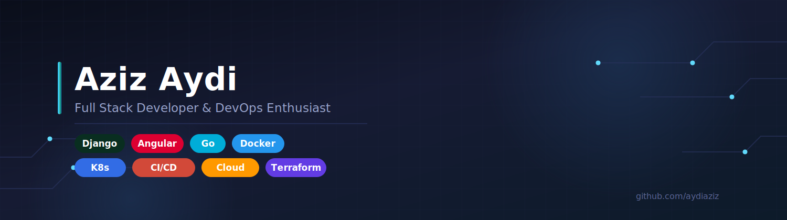

 

  
  

 

## 🧑‍💻 About Me

I'm a **Full Stack Developer** building end-to-end web applications — from robust backends to polished, reactive frontends. Passionate about clean architecture, performance, and sharing knowledge with the dev community.

 

<table>
<tr>
<td valign="top" width="33%">

### 🔧 Backend
- 🐍 **Django** — REST APIs, ORM, auth
- 🐹 **Go** — services, performance-critical APIs
- 🐘 PostgreSQL

</td>
<td valign="top" width="33%">

### 🎨 Frontend
- 🅰️ **Angular** 10+ — RxJS, Signals
- 🧩 Micro Frontend architecture
- ⚡ Angular Universal (SSR)

</td>
<td valign="top" width="33%">

### ⚙️ DevOps
- 🐳 Docker & Docker Compose
- ☸️ Kubernetes (K8s)
- 🔁 CI/CD pipelines
- ☁️ Cloud deployment
- 🌍 Terraform (IaC)

</td>
</tr>
</table>

 

## 🛠️ Tech Stack

  
   
  

 

## 📌 Featured Projects

| Project | Description | Stack |
|---|---|---|
| [langage_des_signes](https://github.com/aydiaziz/langage_des_signes) | Sign language recognition/translation project | Python |
| [ndvi-webapp](https://github.com/aydiaziz/ndvi-webapp) | Web app for NDVI (vegetation index) analysis | Python |
| [factures](https://github.com/aydiaziz/factures) | Invoice management application | HTML |
| [les-elections-des-municipalit-s-](https://github.com/aydiaziz/les-elections-des-municipalit-s-) | Municipal elections project (Tunisia) | — |
| [mvA](https://github.com/aydiaziz/mvA) | Web project | HTML |
| [sports](https://github.com/aydiaziz/sports) | Sports-related application | Python |

 

## 📊 GitHub Stats

  
  

  

 

## 🐍 Contribution Snake

  

 

### 📫 Let's Connect

<a href="https://www.linkedin.com/in/aziz-aydi-a7923721b/">LinkedIn</a> • <a href="https://github.com/aydiaziz">GitHub</a>

⭐️ Feel free to explore my repositories and reach out for collaboration!

